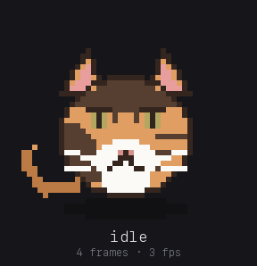

# Agent Pet

[](https://github.com/lijuno/agent-pet/actions/workflows/ci.yml)

A small desktop companion that reacts to what your coding agent is doing.
Claude Code starts, the pet wakes up. A tool runs, it gets to work. A permission
prompt appears, it turns and asks for you. Tests pass, it celebrates.

<p align="center">
  
</p>

<p align="center">
  <sub>Every state the pet can be in, rendered from the sprites it actually
  ships — <code>make states-gif</code>.</sub>
</p>

**This repository contains Milestones 1 and 2** — the pet engine, the local
event API, `petctl`, the desktop window, a pixel-art character,
and the Claude Code adapter. The Codex adapter is Milestone 3;
[`docs/adr/0006-milestone-1-boundaries.md`](docs/adr/0006-milestone-1-boundaries.md)
records which seam each deferred piece attaches to.

```
   agent events  ──▶  local state machine  ──▶  expressive character
```

## Requirements

- macOS (the architecture allows Windows and Linux; only macOS is exercised)
- Xcode Command Line Tools — `xcode-select --install`. The menu-bar item is
  Objective-C compiled through cgo, so a build needs clang; `codesign`,
  `notarytool` and `stapler` come from here too. Full Xcode is never needed.
- Go 1.23+
- [Wails CLI](https://wails.io/docs/gettingstarted/installation) **v2.10.2 or
  newer** — matching the version in `go.mod`. An older CLI fails to build on a
  recent Go toolchain with `internal error: package "strings" without types`,
  which does not look like a version problem:

  ```bash
  go install github.com/wailsapp/wails/v2/cmd/wails@v2.10.2
  ```

  That installs into `$(go env GOPATH)/bin`, which is not on `PATH` by default
  on macOS — so `wails` may be on disk and still not be a command you can run.
  The Makefile looks there as well as on `PATH`, so `make build` works either
  way; add it to your shell if you want to run `wails` yourself:

  ```bash
  export PATH="$PATH:$(go env GOPATH)/bin"
  ```
- Python 3 with Pillow, only if you want to regenerate the sprite art

## Quick start

```bash
go mod tidy          # resolves Wails and yaml; needed once
wails dev            # runs the pet with hot reload
```

In another terminal:

```bash
go build -o bin/petctl ./cmd/petctl

bin/petctl doctor
bin/petctl test celebrate --for 8s
bin/petctl event claude permission_requested
bin/petctl watch
```

## Cutting a release

```bash
git tag v0.2.0     # the tag is the version; it reaches Info.plist via brand.sh
make release       # builds, notarizes, uploads, writes the manifest
```

`make release CHANNEL=dev` cuts the dev app instead, from a prerelease tag. The
two are built, signed and published separately; a release is one app or the
other, never both.

That builds the bundle, signs and staples it, attaches
`agent-pet-<version>-universal.zip` to the GitHub release — and then stops,
leaving `updates/release.json` modified and **uncommitted**. Apple usually
answers within a few minutes.

Nobody is offered the new version until you commit that file:

```bash
git diff updates/release.json
git commit -am "Offer 0.2.0 on the release channel" && git push
```

Publishing an asset and offering it over the air are deliberately two acts. You
can build a release, install it yourself, live with it for a week, and only then
decide — and the decision has a diff, a commit message, and `git revert` as the
undo. See [`updates/README.md`](updates/README.md) and
[ADR 0008](docs/adr/0008-over-the-air-updates.md).

The individual steps are still there when you want them: `make build`,
`make notarize`.

Skip the tag and `make release` refuses: it takes the version from the tag on
HEAD, choosing the plain one for the release app and the prerelease for the dev
app, so both can be cut from the same commit. An untagged `make build` falls
back to `wails.json`, which is the only thing that file is still for.

`make build` alone needs nothing beyond the Requirements above. `make notarize`
needs Apple credentials, and those do not travel with a clone — on a machine
that has never signed:

1. **The certificate.** Import your `.p12` backup (double-click it, give the
   export password). Do not create a second one: Apple caps how many Developer
   ID certificates an account may hold, and a certificate whose private key is
   on another Mac cannot sign anything. Confirm with

   ```bash
   security find-identity -v -p codesigning
   ```

   You want one `Developer ID Application: Your Name (TEAMID)`.

2. **The notary credentials**, from the App Store Connect API key. The `.p8`
   downloads exactly once and can never be re-fetched, so it is in your
   password manager or it is gone:

   ```bash
   xcrun notarytool store-credentials agent-pet --key AuthKey_XXXXX.p8 --key-id YOUR_KEY_ID
   ```

3. **The profile name**, so `make notarize` takes no arguments. The file is
   git-ignored, because it names a keychain item that exists only here:

   ```bash
   echo agent-pet > .notary-profile
   ```

Releases are cut by hand for the same reason step 1 is fiddly: signing on a
runner would mean a copy of that private key in the repository's secrets.
[`docs/signing.md`](docs/signing.md) covers the first-time Apple setup behind
all three — enrolment, creating the certificate, and creating the API key —
and what to do when a step fails.

A bundle you build yourself is neither signed nor notarized; a released one is.
One you built yourself runs without complaint, because Gatekeeper only
quarantines what arrives from elsewhere. One you downloaded is quarantined, and
macOS refuses it with *"Agent Pet" is damaged and can't be opened*, which is not
what has happened: the app is intact and unsigned. To run it anyway:

```bash
xattr -d com.apple.quarantine /Applications/agent-pet.app
```

Do that only if you trust where the bundle came from, and never on a release —
a signed one needs no such thing, and an agent asked to install this app will
run that command without hesitating if the README implies it is routine.

## Updating

```bash
petctl update --check     # is there a newer one?
petctl update             # install it
```

`petctl update` quits the pet, downloads the release, and refuses to install it
unless the hash matches the manifest, `codesign` and `spctl` both pass, and the
download carries **the same Apple team identifier and bundle identifier as the
app it is replacing**. Notarization says somebody legitimate signed it; those
last two say it was us, and that it is this app rather than the other one. Then
it swaps the bundle — old one moved aside, not deleted, until the new one has
landed — waits for the event port to actually come free, and starts the new
version. A build you made yourself is never replaced.

When a check finds something, an item naming the version appears in the menu-bar
menu and opens the release notes. It does not install: the app holds no updater
and opens no connections of its own. `petctl` does the work, which is why
[SECURITY.md](SECURITY.md) can still say the daemon never dials out.

Nothing checks on its own unless you ask it to. `update.check: true` in the
config file runs one at most once a day when a Claude Code session starts.

### Two apps, not two channels

There is a second application:

| | Bundle | Listens on | Updates from |
|---|---|---|---|
| **Agent Pet** | `agent-pet.app` | `127.0.0.1:9876` | `updates/release.json` |
| **Agent Pet (dev)** | `agent-pet-dev.app` | `127.0.0.1:9877` | `updates/dev.json` |

They install side by side, the way VS Code ships Stable and Insiders. There is
no channel setting and nothing to switch: to follow prereleases, install the dev
app; to stop, quit it. Each has its own config file, data directory and menu-bar
icon, and neither can update itself into the other.

The point of that is what happens when a prerelease is broken — which is what
prereleases are for. Your working pet is a different application and is still
running. You can watch both react to the same session at once: `petctl` delivers
every event to every pet that is listening, so no configuration is needed to
compare them.

`petctl doctor` says which of them you have and which are running. The dev app
carries a badge on both its icons and names itself in its menu, because both are
menu-bar-only apps and would otherwise be indistinguishable.

Build it with:

```bash
make build CHANNEL=dev
```

## Connecting Claude Code

```bash
petctl install claude       # this project;  --global for every project
```

Then start a **new** Claude Code session — hooks are read at startup, so the
session you are in now will not pick them up. `petctl watch` shows the events
arriving. `petctl doctor` says whether the hooks are installed, and
`petctl uninstall claude` removes them again.

See [`adapters/README.md`](adapters/README.md) for the hook-to-event table and
what the adapter deliberately does not try to detect.

## Trying every state

To see the whole character without waiting for an agent to do something:

```bash
for s in idle thinking working attention confused worried happy celebrate sleeping heart; do
  petctl test $s --for 2s; sleep 2
done
```

Or drive a realistic session by hand:

```bash
petctl event claude session_started --session demo
petctl event claude thinking_started --session demo
petctl event claude tool_started --session demo --meta tool=bash
petctl event claude permission_requested --session demo
petctl event claude tool_started --session demo --meta tool=edit
petctl event claude task_completed --session demo
petctl event claude tests_passed --session demo
```

## Interacting with the pet

| Action | Result |
|---|---|
| Drag | Move the pet. Its position is remembered. |
| Double-click | Pet it. |
| Right-click | Menu: status, statistics, change pet, size, always on top, mute, quit. |
| Menu bar | The same commands under the `Pet` menu while the app is frontmost. |

The pet also lives in the macOS menu bar. Its icon shows the current state and
carries the same commands. **Show Pet** is a checkbox there: it puts the pet
away and brings it back, and bringing it back also retrieves one that has been
dragged off the edge of the screen. **Change Pet** is a submenu listing the
characters, so switching happens in the menu bar rather than in a panel beside
the pet. See [ADR 0005](docs/adr/0005-macos-menu-and-tray.md).

The character comes in three sizes — small, medium and large — from the
right-click menu or the `pet.scale` setting.

Two rules decide whether she is awake, and neither has a special case:

- **No agent, no pet.** Claude Code exiting puts her to sleep at once, and so
  does never having started.
- **Idle and quiet for a minute** and she dozes off, waking on the next event.

A pending request is `attention`, not idle, so it falls outside the second rule
rather than being excused from it — nobody answers a prompt they were never
shown.

When no agent is connected — Claude Code has exited, or has not started — the
character greys out. Awake and in colour means something is there to watch;
grey means the pet is running but nothing is. A state forced with
`petctl test` keeps its colour, since the point of forcing one is to look at it.

## Configuration

`~/.config/agent-pet/config.yaml` is written on first run.

```yaml
pet:
  active: momo          # momo, or your own pack
  always_on_top: true
  scale: 1.0
  drop_shadow: true     # off if it reads as a halo on a light wallpaper

behavior:
  dialogue: true        # speech bubbles

personality:
  name: SanMao (三毛)
  personality: gentle   # gentle cheerful calm mischievous sarcastic energetic

thresholds:
  idle_after: 30s       # a quiet agent stops looking busy
  sleeping_after: 60s   # ... and shortly after that, dozes off

server:
  addr: 127.0.0.1:9876

update:
  check: false          # nothing contacts the network until this is true
  interval: 24h
```

There is no channel setting: which channel a build follows is decided when it is
built. The dev app is a separate install — see [Updating](#updating).

Anything you leave out keeps its default. A malformed file logs a warning and
falls back to defaults rather than refusing to start.

## The event API

Any local process can drive the pet:

```bash
curl -sS -X POST http://127.0.0.1:9876/event \
  -H 'content-type: application/json' \
  -d '{"source":"claude","event":"tests_passed","session_id":"abc"}'
```

| Endpoint | Purpose |
|---|---|
| `POST /event` | Submit an event |
| `GET /state` | Current snapshot |
| `GET /stream` | Server-sent events, one per state change |
| `POST /test` | Force a state (`petctl test`) |
| `GET /diagnostics` | Everything `petctl doctor` prints |
| `POST /window` | Move the window or open a panel — see below |
| `GET /pets`, `POST /pet` | List and switch characters |
| `GET /update`, `POST /update` | What the last update check found. `petctl` posts here; the pet never looks for itself |

`POST /window` parks the window, opens its overlays and performs menu-bar items,
doing nothing you cannot do with a mouse. It exists because a test has no mouse:
the only way to know whether a menu is clipped in the corner of a screen is to
open one in the corner of a screen and measure it, and nothing on macOS may read
a menu bar without accessibility access. `make test-desktop` drives it; by hand:

```bash
curl -sS -X POST http://127.0.0.1:9876/window \
  -H 'content-type: application/json' -d '{"x":0,"y":400}'
curl -sS -X POST http://127.0.0.1:9876/window \
  -H 'content-type: application/json' -d '{"panel":"menu"}'
petctl doctor      # ... overlay  176x224 at 62,168 — fully on screen
```

The listener binds `127.0.0.1` and refuses anything else unless you explicitly
set `server.allow_non_loopback`. See [`docs/events.md`](docs/events.md) for the
full event vocabulary and [ADR 0002](docs/adr/0002-event-transport.md) for the
hardening applied to untrusted input.

## Characters

One built-in pack ships in the binary:

| id | | |
|---|---|---|
| `momo` | SanMao (三毛), a tortoiseshell tabby | white bib, white socks, green eyes |

Everything that makes a second character work is still here — the library, the
Change Pet submenu, `GET /pets`, `POST /pet` and their tests. `tools/genpets`
still carries a second species definition as a worked example; shipping it
again is one line.

It provides all ten states as 40×40 pixel-art sprite strips. Regenerate
them with:

```bash
make pets     # python3 tools/genpets/genpets.py
```

Your own packs go in `~/.local/share/agent-pet/pets/<id>/` and are picked up
at startup. A pack with the same id as a built-in replaces it. The format is one
PNG strip per state plus a `manifest.json`; see [`docs/pets.md`](docs/pets.md).

## Privacy

- No prompts, no source code, no command arguments are recorded. Default logs
  contain event categories only; `logging.verbose: true` adds tool names.
- The pet itself has no network client of any kind: it listens on loopback and
  calls nothing out. Updates are fetched by `petctl`, a separate program, and
  only when you run it — automatic checks are off until you turn them on.
- Character packs are built from local images. Nothing is uploaded, and there is
  no image-generation service to opt into.
- No accessibility, screen-recording, camera, microphone or keyboard-monitoring
  permission is requested, and no elevated privileges are needed.

The event API is unauthenticated, so anything running as you — including
whatever you ask your agent to run — can drive the pet. What that is and is not
worth worrying about is set out in [SECURITY.md](SECURITY.md), along with how
to report something privately.

## Layout

```
main.go                the entry point: flags, config, logging, wiring
internal/desktop/      the Wails shell — the only package that imports Wails
internal/events/       the internal event vocabulary and its sanitiser
internal/state/        the deterministic state machine
internal/engine/       event intake, timers, subscribers
internal/server/       the loopback event API
internal/petassets/    pet pack loading
internal/bubble/       template speech
internal/config/       config.yaml
internal/flavor/       what makes Agent Pet and Agent Pet (dev) two apps: the
                       bundle id, port, paths and icons that must never be shared
internal/update/       the update manifest and version comparison — no network,
                       no subprocess, so petd stays free of both (ADR 0008)
cmd/petctl/            the CLI (no shared code with the engine), and the whole
                       of the updater: the fetch, the checks, the bundle swap
updates/               the channel manifests — committing one is what publishes
                       a release to everybody
adapters/claude/       the Claude Code hook adapter
adapters/              Codex and git adapters — Milestone 3 and later
tools/genpets/         the sprite generator
ui/dist/               the frontend, embedded in the binary
ui/test/               its tests — open in a browser, no build step
docs/adr/              architectural decisions
```

## Tests

```bash
make test          # Go: engine, state machine, event API, adapter, placement
make test-ui       # the window, in a browser
make test-desktop  # the menu bar and corner placement, against a running app
```

CI runs the first of those on every push, against the Go version `go.mod`
declares and against current stable, and builds the app bundle. It cannot run
the other two: one needs a browser and the other needs the app running and
drives its menu bar. A green tick is not evidence that a menu handler works.

The state machine is a pure function of (events, clock), so its tests drive a
synthetic clock and never sleep. See
[ADR 0004](docs/adr/0004-deterministic-state-machine.md).

`make test-ui` serves the repository and opens
[`ui/test/index.html`](ui/test/index.html), which loads the real
`ui/dist/index.html` into a fresh iframe for each test and reports pass/fail on
the page. There is no runner to install and no build step, because the UI is one
static file and its tests should cost the same to run. They cover sprite
rendering and timing, the panels and menu, click versus double-click, the
layout invariant that an open panel never covers the pet, and — most
importantly — that nothing an agent controls can become markup (§26).

## License

MIT — see [LICENSE](LICENSE).

The pixel art is generated by `tools/genpets/genpets.py` in this repository and
is covered by the same licence. A release binary also contains
[Wails](https://github.com/wailsapp/wails) (MIT) and
[yaml.v3](https://github.com/go-yaml/yaml) (MIT and Apache 2.0); if you
redistribute built binaries rather than source, include their notices too.
